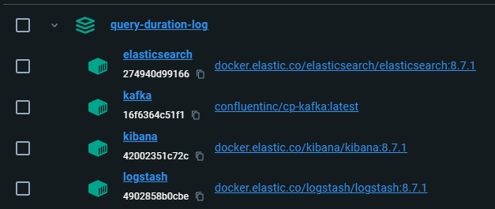

# Chạy file docker-compose
Thực hiện cd vào thư mục root của project này (nơi chứa file docker-compose) và chạy:
```shell
docker-compose up -d
```
Chờ các node chạy hết lên là ok

# Chạy project spring boot
Chạy lệnh
```shell
./mvnw spring-boot:run
```
Hoặc đơn giản hơn là mở Intellij lên rồi bấm nút run là được
# Gọi thử các API để chờ lên log
Chạy thử API để tạo user, chạy vài lần cho lên nhiều log
```shell
curl -X POST --location "http://localhost:8088/users" \
    -H "Content-Type: application/json" \
    -d '{
          "username": "Huy"
        }'
```
Chạy thử API truy vấn user
```shell
curl -X GET --location "http://localhost:8088/users" \
    -H "Content-Type: application/json"
```
# Xem log
Vào link sau để xem log: http://localhost:5601/app/discover#
